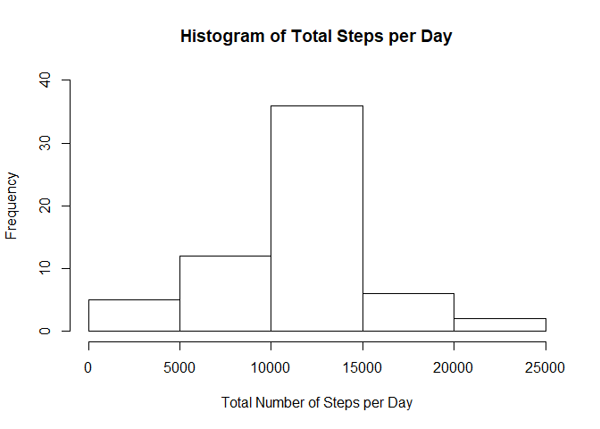

## Loading and preprocessing the data

```r
data <- read.csv("activity.csv", header = TRUE, stringsAsFactors = FALSE)

library(lubridate)
```

```
## 
## Attaching package: 'lubridate'
```

```
## The following object is masked from 'package:base':
## 
##     date
```

```r
data$date <- as_date(data$date)

library(dplyr)
```

```
## 
## Attaching package: 'dplyr'
```

```
## The following objects are masked from 'package:lubridate':
## 
##     intersect, setdiff, union
```

```
## The following objects are masked from 'package:stats':
## 
##     filter, lag
```

```
## The following objects are masked from 'package:base':
## 
##     intersect, setdiff, setequal, union
```

```r
library(tidyr)
```


## What is mean total number of steps taken per day?

### Make a histogram of the total number of steps taken each day


```r
steps_day <- na.omit(data) %>%
        group_by(date) %>%
        summarize(totalsteps = sum(steps))

hist(steps_day$totalsteps, 
     ylim = c(0 ,30),
     main = "Histogram of Total Steps per Day",
     xlab = "Total Number of Steps per Day"
)
```

<!-- -->

### Calculate and report the mean and median total number of steps taken per day

```r
results <- summary(steps_day$totalsteps)
print(results[3:4])
```

```
##   Median     Mean 
## 10765.00 10766.19
```

## What is the average daily activity pattern?

### Process the data

```r
steps_interval <- na.omit(data) %>%
        group_by(interval) %>%
        summarize(averagesteps = mean(steps))
```

### Make a time series plot (i.e. type = "l") of the 5-minute interval (x-axis) and the average number of steps taken, averaged across all days (y-axis)

```r
plot(steps_interval$interval,
     steps_interval$averagesteps,
     type = "l",
     ylab = "Average Number of Steps Taken",
     xlab = "Time Interval"
     )
```

<!-- -->

### Which 5-minute interval, on average across all the days in the dataset, contains the maximum number of steps?

```r
filter(steps_interval, averagesteps == max(averagesteps))
```

```
## # A tibble: 1 x 2
##   interval averagesteps
##      <int>        <dbl>
## 1      835         206.
```


## Imputing missing values

### Calculate and report the total number of missing values in the dataset (i.e. the total number of rows with NAs)


```r
sum(!complete.cases(data))
```

```
## [1] 2304
```

### Devise a strategy for filling in all of the missing values in the dataset.  
I decided to impute the mean from each 5-minute interval (using the resultes calculated to answer the previous question). 

```r
data_imv <- data %>%
        filter(is.na(steps))
steps_i <- as.data.frame(steps_interval)
data_imv$steps <- steps_i[match(data_imv$interval, steps_i$interval), "averagesteps"]
```

### Create a new dataset that is equal to the original dataset but with the missing data filled in.

```r
data_sub <- data %>% 
        filter(!is.na(steps))

data_new <- data_imv %>%
        bind_rows(data_sub) %>%
        arrange(date, interval)

steps_day_new <- data_new %>%
        group_by(date) %>%
        summarize(totalsteps = sum(steps))
```


### Make a histogram of the total number of steps taken each day

```r
hist(steps_day_new$totalsteps, 
     ylim = c(0 ,40),
     main = "Histogram of Total Steps per Day",
     xlab = "Total Number of Steps per Day"
)
```

<!-- -->

### Calculate and report the mean and median total number of steps taken per day. 

```r
results_new <- summary(steps_day_new$totalsteps)
print(results_new[3:4])
```

```
##   Median     Mean 
## 10766.19 10766.19
```

### Do these values differ from the estimates from the first part of the assignment? What is the impact of imputing missing data on the estimates of the total daily number of steps?
Due to the fact that the mean values of each time interval were used to impute values for the missing data, the mean does not change in the new data set.  In the data with the missing values, the medain was very close to the mean, so it is not surprising that the median value is equal to the mean value in the new data set.

## Are there differences in activity patterns between weekdays and weekends?

### Create a new factor variable in the dataset with two levels -- "weekday" and "weekend" indicating whether a given date is a weekday or weekend day.

```r
data_new$date <- as.Date(data_new$date)
data_wd <- data_new %>%
        mutate(dayofweek = weekdays(date))
data_wd$weekday <- ifelse(data_wd$dayofweek %in% c("Saturday", "Sunday"), "weekend", "weekday")

data_wdp <- data_wd %>%
        group_by(weekday, interval) %>%
        summarize(avesteps = mean(steps))
```

### Make a panel plot containing a time series plot (i.e. type = "l") of the 5-minute interval (x-axis) and the average number of steps taken, averaged across all weekday days or weekend days (y-axis).

```r
end <- data_wdp %>% 
        filter(weekday == "weekend")

day <- data_wdp %>% 
        filter(weekday == "weekday")

par(mfrow = c(2, 1))
plot(end$interval,
     end$avesteps,
     type = "l",
     ylim = c(0,240),
     ylab = "Average Number of Steps",
     xlab = "Time Interval",
     main = "Weekend"
)
plot(day$interval,
     day$avesteps,
     type = "l",
     ylim = c(0,240),
     ylab = "Average Number of Steps",
     xlab = "Time Interval",
     main = "Weekday"
)
```

<!-- -->
